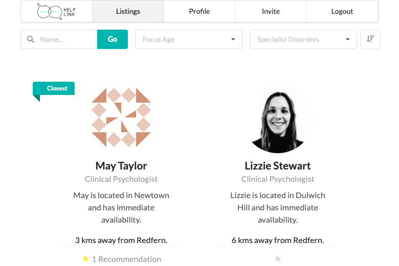
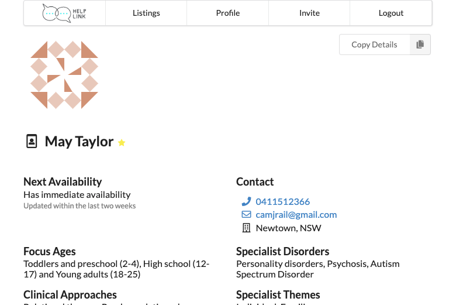

Anyone who has tried to access professional mental health services during the pandemic knows how
difficult availability is to find.  While this may seem like a problem that end clients face,
and it certainly is, it is also something that help professionals (mental health professionals)
themselves experience.

Help professionals are constantly asked about their availability, and inevitably if they say they
have none they are then asked if they know anyone who does.  The problem is that there is no way
easy way for them to search for trusted colleagues and assess their availability.

# What is it?
Help Link Private is an invite only referral network for help professionals.  The site is designed
to be a trusted peer network, with information that is meaningful to other professionals when
they are making assessments about referring on incoming enquiries to others.

The simple app consists of:
- Help professional listings
- Invite and recommendation system

# The Stack.
### Webapp
- Python/Django
- Vanilla JS
- Semantic-UI CSS framework

### Serving
All AWS
- EC2
- S3
- SMS
- Docker
- PSQL (containerised)

### Key python packages
- Django
- Django AllAuth
- Cookie Cutter Django

# Credits
### My roles:
- Development
- Product Management
- Devops

# Key Components | help-seeker users
## Onboarding funnel
Help seekers are directed into a short questionnaire
which collects information so that the system can find
a good match with a psychologist.

We start by asking their preferred mode of session:

And proceed with additional questions to find the right area:

## Match generation
Once we have enough information about the help seeker,
we can feed it into our matching algorithm
(which at the moment is pretty basic).

## Selection and booking
We then allow the client to select from their matches
and book directly on the platform.

# Key Components | help-provider users
## Listings
Main page in the app is the listings view which by default sorts help professionals by their availability.
Each listing is shown that meets the current filter criteria, with user uploaded profile pictures displayed
or a generated gravatar if no user uploaded picture is available.

## Suggested and advanced searching
Advanced search is at the core of the professional offering given that these
users are aware of the technical terms of what they are looking for.

To cut through this complexity, suggested searches give users a base that they can then tweak
as required to find what they are looking for.

## Invitations flow
As this is an invite-only network, new help professionals are invited by their peers via the platform.
Invite IDs are masked to ensure that un-invited users can't guess the next invite URL (the 73 in the link below is a mask).

The single use invite link directs new users to a username and password or Google Oauth flow.

Once the signup method has been chosen and completed, new help professionals are then directed to the onboarding wizard.

## Listings Filtering and Sorting
By default, listings are unfiltered and sorted by availability.  However they can be filtered by the age group that the
practitioner sees, and/or their specialist areas.  Listings can also be sorted by closest to a particular suburb.
Location based search is actioned by:
- Using the Google Places API for places search, filtered to suburbs/regions in Australia
- Taking the postcode of that place and then sending it to the server for processing
- Using the Geonames database to find the lattitude and longtitude of the given postcode vs the postcode of each of the listings
- Using the GeoPy package to find the distance between the postcodes

#### Selecting proximity to suburb

#### Viewing results by proximity

## Easy to Update Availability
One of the key benefits of the app is that help professionals are able to see the current waiting list of peers that they are
considering referring to.  Often it's not as simple as 'finding a spot in the calendar' - when a mental health professional
takes a new patient on, they are making an assessment as to when and for how long they can fit them in.  As such, we need
the help professional to update directly what their next availability is like.

To achieve this, a monthly email is sent with a list of options for current waiting periods.  This way, the help professional
can simply click the button which corresponds to their current waiting period, and quickly update this in the system.

Once the user has updated their listing, prospective referrers are then informed that the availability has been recently updated.

