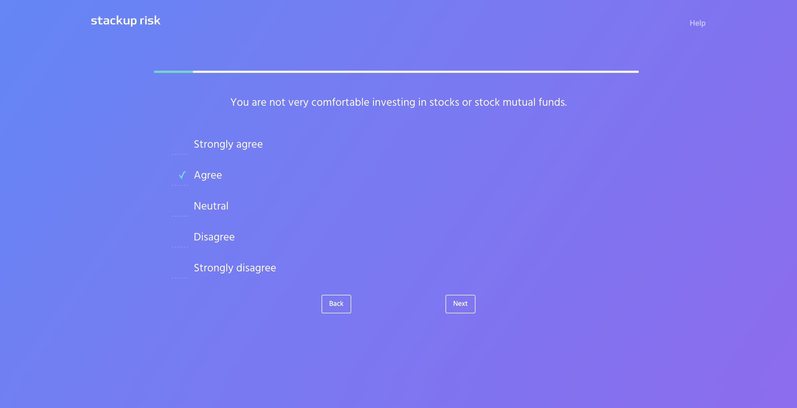
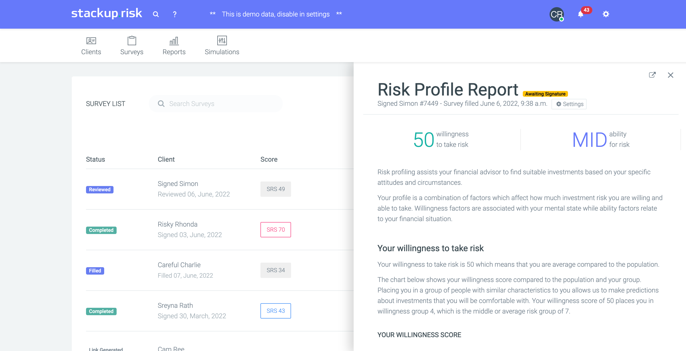
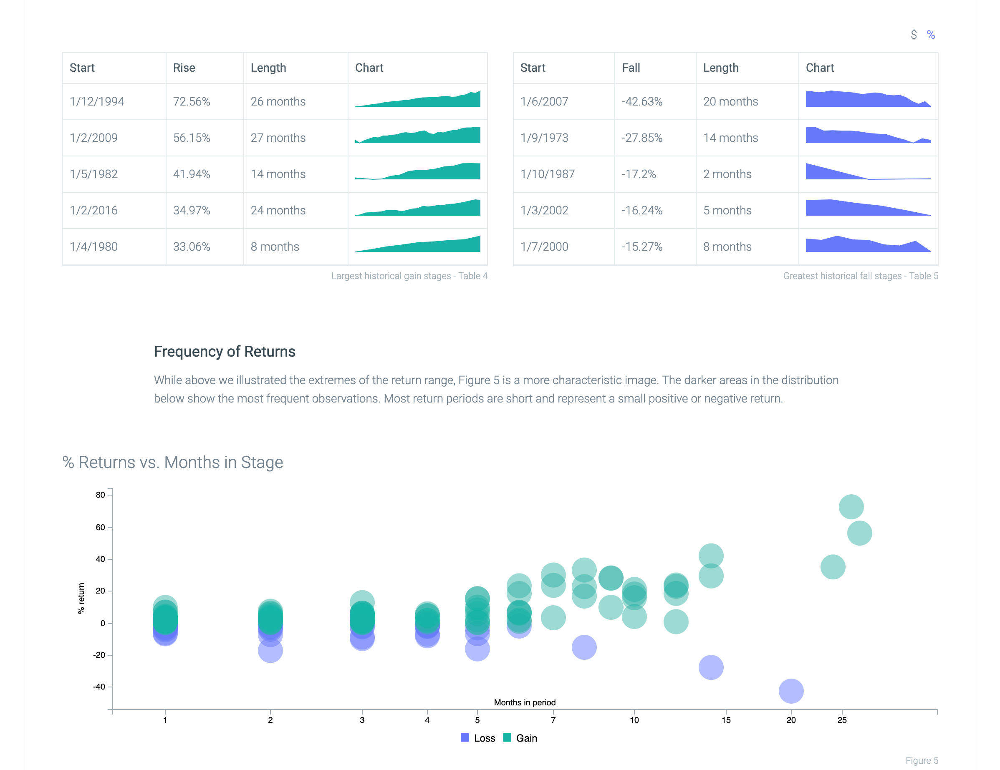
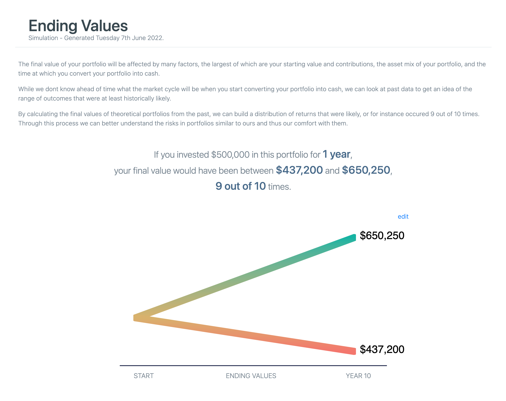
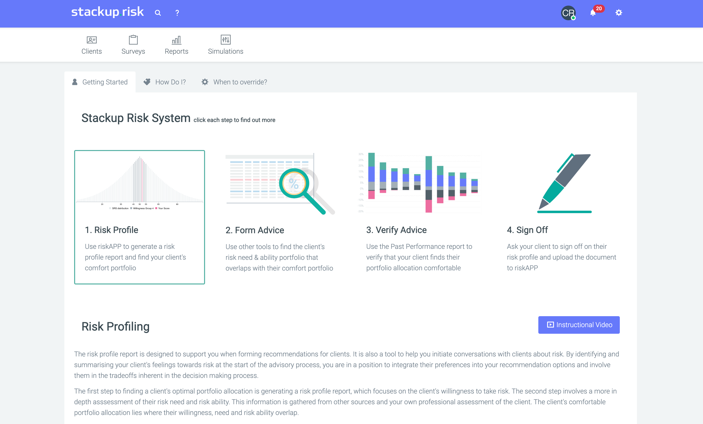
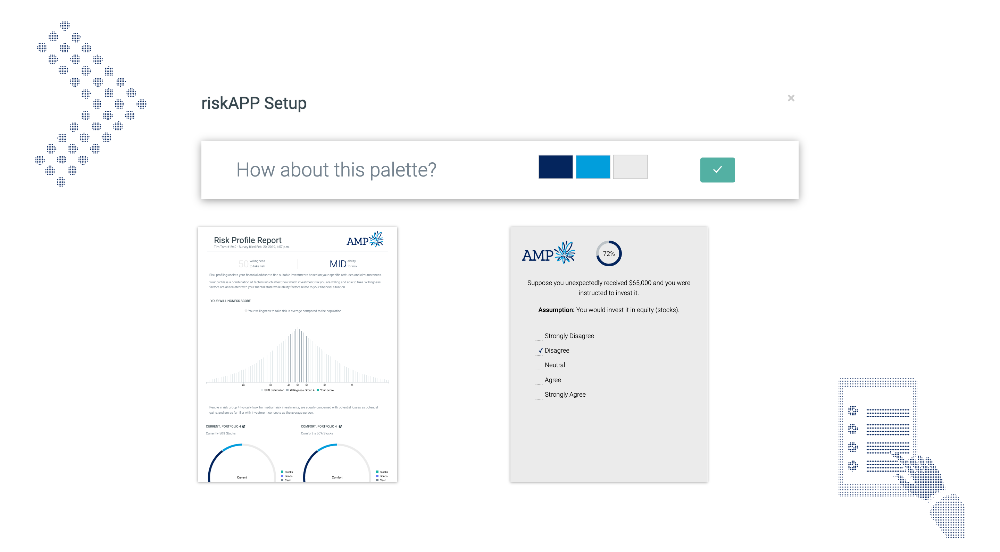
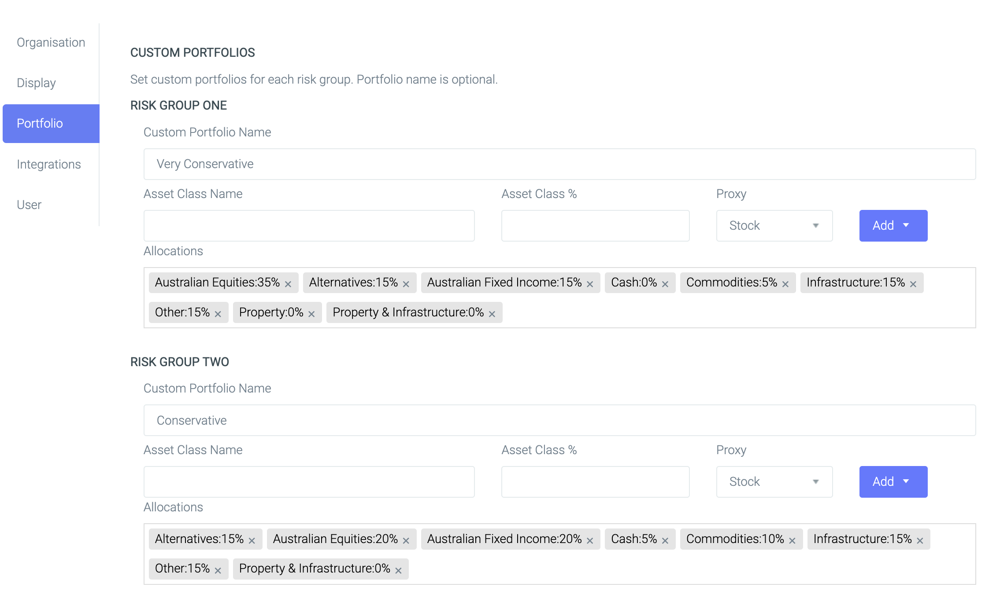
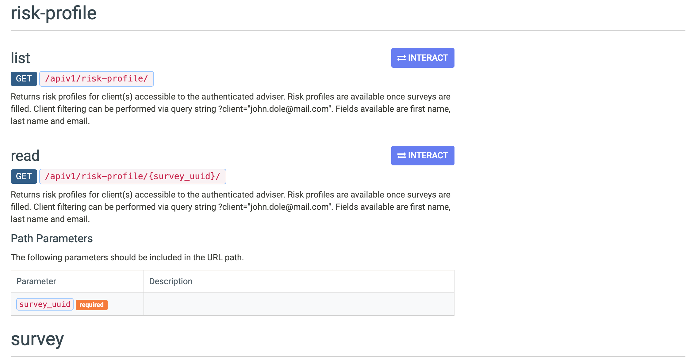

Stackup Risk began as a side project which was eventually acquired by an end to end financial advice platform.  What started as my first python project and webapp, became a three year journey into financial risk tolerance, psychometrics, SaaS, Django, javascript, devops and everything in between.

# What is it?
Stackup is a financial risk profiling tool which helps to match investments to an investor's psychology.  Using psychometrics (applied statistics for psychology) we assess how much risk a particular investory is willing to take, so we can then help their financial adviser recommend appropriate assets and avoid the stress and negative wealth implications of owning a portfolio which is 'too' risky.

- [Introduction Video](https://vimeo.com/719815874)
- [Application Screens](https://www.behance.net/gallery/145898429/riskAPP-Webapp-Highlights)
- [Website Screens](https://www.behance.net/gallery/145691951/riskAPP-Marketing-Site)

# The stack.
### Webapp
| Language | Files | Lines | % |
| :--- | ---: | ---: | ---: |
| Django Template (HTML) | 153 | 42,035 | 65% |
| Python | 342 | 16,265 | 25% |
| JavaScript* | 59 | 6,578 | 10% |

*majority is vanilla JS and Jquery, remainder is React.

### Serving
All on AWS
- Docker
- Load balancer
- 2 x EC2 instances
- Postgres
- S3
- Cloudfront

### Key python packages
- Numpy
- Dj Stripe
- Django Rest Framework
- Celery
- Selenium

# Timeline

    
    
    
    
    
    
    


# Credits
### My roles:
- Product Management
- Development
- Design (supported by templates)
- Research & Method (commercialisation)
- Statistics / Psychometrics
- Content Creation

### Helped by:
#### Hunter Holzhauer
- Research & Method ([Original academic study](https://www.emerald.com/insight/content/doi/10.1108/JRF-04-2016-0054/full/html))
#### Lizzie Stewart
- Statistics / Psychometrics
- Content Creation

# Key Components
### Questionnaire
**Purpose:** quantitatively measure an individual's risk tolerance.

Features
- Psychometric financial risk profiling questionnaire.
- Questions dynamically generated at run time based on previous questions.
- Each factor within the model is scored and then combined into the risk profile.

### Risk Profile Report
**Purpose:** help an investor to understand their risk psychology to guide them into matching investments.

Features
- Based on questionnaire, willingness and ability to take risk is calculated and displayed.
- Report is dynamically generated at run time based on responses and Organisation custom portfolios.
- Available to view online or via PDF.

### Past Performance Report
**Purpose:** qualitatively validate the quantiative risk profile measurement by showing an investor what it feels like to own a portfolio and then assessing their comfort.

Features:
- Long term return data is calculated via a user provided asset allocation and then dynamic annual rebalancing of the portfolio.
- Data is then diced and sliced to provide the investor insights into their portfolio characteristics.
- Returns can be rendered in percentage terms or dollar terms relative to the invetor's portfolio value.
- Loss experience provided, showing an investor what their boom to bust experience would have been during key market events.

### Ending Values Simulation
**Purpose:** demonstrate to investors the normal range of returns they can expect from a given risk profile.

Features:
- Long term portfolio returns calculated including rebalancing.
- Build the distribution of returns to calculate a confidence interval and what is 'normal'.
- Display to the client what is 'normal' with toggles for the adviser to re-cut the information.

#### User Help
**Purpose:** in-app help to reduce the need for users to reach out to support.

Features:
- Welcome wizard which guides users around the application with contextual help.
- Self serve help with demo video GIFs and process guidance.

### Platform Customisation
#### White labelling
**Purpose:** customise client facing materials with brand logos and colours.

Feartures:
- Upon first launch, integration automatically pulls company logo based on user's email address.
- Based on logo, brand colours are derived to fill a suggested palette.
- Palette and logo used for survey and reports.

#### Custom portfolios
**Purpose:** allow firms to use their in-house risk profile asset allocations through the app.

Feartures:
- Ability to set risk profile asset allocations (RPAA) for each risk group.
- RPAA feeds through to Risk Profile report as the comfort portfolio.
- RPAA is used as initial portfolio on the Past Performance report for returns simulation.

#### API & Developer Console
**Purpose:** developer playground to test the API.

Feartures:
- Endpoints for all major functions with integrations into IRESS Xplan, ROAR Software, Zapier, Wealth360, Salesforce.
- Webhooks for live event updates.
- Developer playground to test functionality and response cycles.
